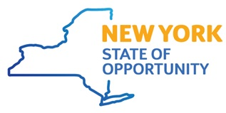

# abb_robot_client 
[](https://github.com/rpiRobotics/abb_robot_client)

This package is forked from https://github.com/rpiRobotics/abb_robot_client and has been modified and modernized.


Python package providing clients for ABB robots using RWS (Robot Web Services) and Externally Guided Motion (EGM). 
This package supports IRC5 controllers running RobotWare 6.xx as well as Omnicore controllers running RobotWare 7+.

This package is typically used with [abb-motion-program-exec](https://pypi.org/project/abb-motion-program-exec/),
which provides a higher level interface to generate motion programs. `abb-motion-program-exec` includes the ability
to initialize EGM operations, using this package to communicate with EGM.

`abb_robot_client` includes three modules: `rws`, `rws_aio`, and `egm`. `rws` provides a synhronous client for Robot 
Web Services (RWS) using HTTP REST, and the ability to create subscriptions using websockets. `rws_aio` provides 
identical functionality to `rws`, but uses asyncio, with each method being `async`. `egm` provides an Externally
Guided Motion (EGM) client.

A Robot Raconteur driver is also provided. This driver provides access to RWS and EGM.

Documentation can be found at: https://abb_robot_client.readthedocs.org

## Installation

```
uv add https://github.com/Mesh-ch/abb_robot_client.git
```

## Tests


## License

Apache 2.0

## Acknowledgment

This work was supported in part by Subaward No. ARM-TEC-21-02-F19 from the Advanced Robotics for Manufacturing ("ARM") Institute under Agreement Number W911NF-17-3-0004 sponsored by the Office of the Secretary of Defense. ARM Project Management was provided by Christopher Adams. The views and conclusions contained in this document are those of the authors and should not be interpreted as representing the official policies, either expressed or implied, of either ARM or the Office of the Secretary of Defense of the U.S. Government. The U.S. Government is authorized to reproduce and distribute reprints for Government purposes, notwithstanding any copyright notation herein.

This work was supported in part by the New York State Empire State Development Division of Science, Technology and Innovation (NYSTAR) under contract C160142. 

 


